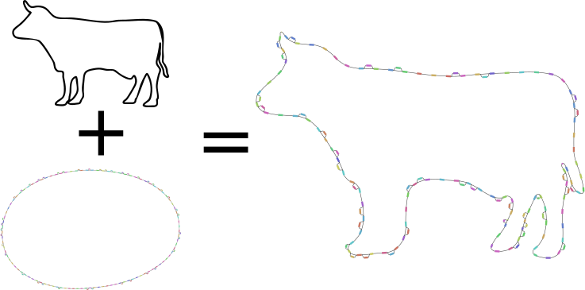

# pandrawer

A fun way to give a pangenomic flavour to your organism of choice.

### Usage

We just need an image (ideally a simple one where the outlining contour can be easily calculated), and output prefix for the *.gfa* and *.layout*.
We can also adjust the number of bubbles we want introduced. 

```bash
pandrawer --image cow.jpg --prefix award_winning_figure --bubbles 20
```

or

```python
import pandrawer

pandrawer.pandrawer("cow.jpg","award_winning_figure",20)
```

You can then load the *.gfa* in `BandageNG` and then subsequently load the *.layout* file.

### Example



### Extensions

`BandageNG` generally produces very nice layouts, but we cannot fix some nodes via a provided *.layout* and let `BandageNG` layout the remaining nodes.
Using various `networkx` force-layout algorithms didn't look nice either, but ideally we can add more complex bubbles/edges in a visually pleasing manner.

This also introduces a fixed number of simple bubbles.
We could recursively add simple bubbles to simple bubbles to create more complex bubbles, or create bubbles with higher degrees. 

